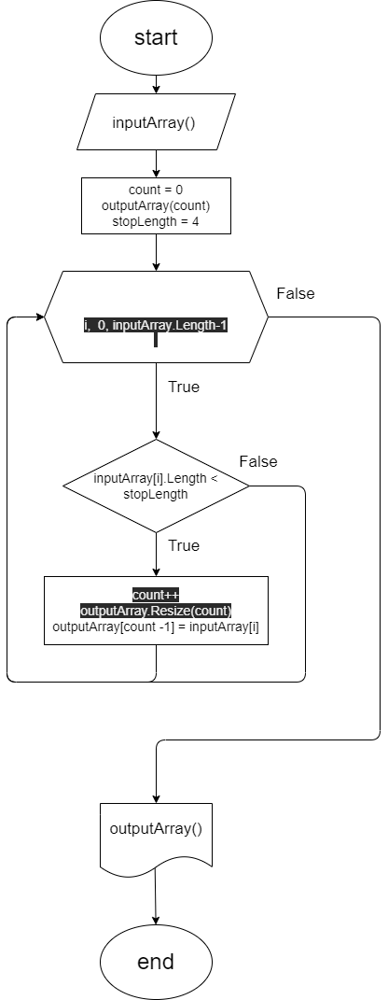

## Контрольная работа.

### Задание.

Написать программу, которая из имеющегося массива строк формирует массив из строк, длина которых меньше либо равна 3 символа. Первоначальный массив можно ввести с клавиатуры, либо задать на старте выполнения алгоритма. При решении не рекомендуется пользоваться коллекциями, лучше обойтись исключительно массивами.

### Декомпозиция.

1. Создать репозиторий на GitHub.
1. Нарисовать блок-схему алгоритма выборки элементов массива по заданнму условию.
1. Написать метод, фильтрующую массив по заданному условию с созданием нового массива.
1. Написать метод для печати элементов массива.
1. Написать пользовательский код для проверки работы алгоритма.
1. Оформить текстовое описание решения (файл README.md)
1. Запушить проект в удаленный репозиторий.

### Блок-схема основного метода.

### Описание решения.

1. Создаем новый массив.
1. Проходимся по оригинальному массиву в поиске строк, удовлетворяющих условию длины меньше 4 (что тождественно значению меньше либо равно трем)
1. При обнаружении строки, удовлетворяющей условию, вносим ее в новый массив, предварительно увеличив его размер.
